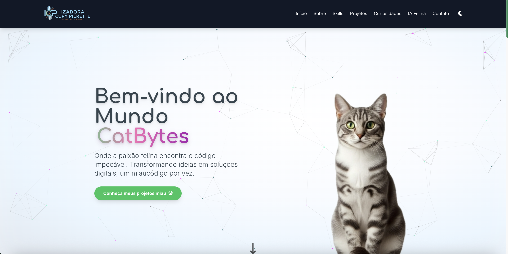
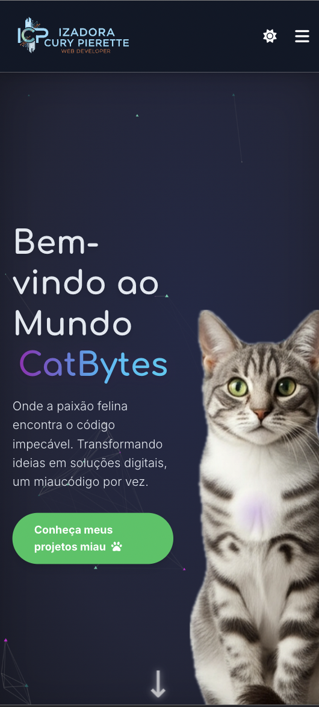

#  CatBytes — Creative Portfolio of Front-end, Automation and AI

[Versão em Português](./README.md)

---

## 🚀 About the Project

**CatBytes** is a creative portfolio that blends **modern design**, **clean code**, and **solutions powered by artificial intelligence and automation**.  
Inspired by the world of cats 🐱 and programming, the project highlights not only technical skills but also creativity and personality.

---

## ✨ Features

- 🎨 Responsive layout (desktop and mobile)  
- 🌙 Light/Dark mode  
- ⚡ Smooth animations with ScrollReveal and JavaScript interactions  
- 🧩 Modular structure (separated HTML, CSS, JS)  
- 📂 Well-structured folders for scalable maintenance  
- 🤖 Features with **Netlify Functions** and **Google Gemini AI**  
- 📊 Interactive project gallery  
- 🐾 Creative extras (badges, tooltips, mock IA tabs)  

---

## 📸 Preview

### Desktop


### Mobile


---

## 📂 Project Structure

Organized for scalability and maintainability:

```
css/          → modular styles (reset, responsive, animations, tailwind, etc.)
images/       → optimized assets and favicon
js/           → JS modules separated by functionality
netlify/      → serverless functions (adopt-cat, identify-cat, generate-ad)
test/         → automated tests (Vitest/Playwright in future)
```

---

## ⚡ Technologies

- **Semantic HTML5**  
- **CSS3** (Flexbox, Grid, Tailwind, modular CSS)  
- **JavaScript (ES6+)** modular  
- **Netlify Functions** + **Google Gemini AI**  
- **Git/GitHub** versioning  
- **Automation** with n8n (Docker on OCI in future)  

---

## 📖 Additional Docs

- [CHANGELOG](./CHANGELOG.md)  
- License available at [LICENSE](./LICENSE)  

---

## 👩‍💻 Author

**Izadora Cury Pierette**  

- 🌐 [LinkedIn](https://www.linkedin.com/in/izadora-cury-pierette-7a7754253)  
- 🐈‍⬛ [GitHub](https://github.com/ipierette)  
- ✉️ [E-mail](mailto:ipierette2@gmail.com)  

---

> 💡 _“Between lines of code and curious meows, the future also purrs in bytes.”_
