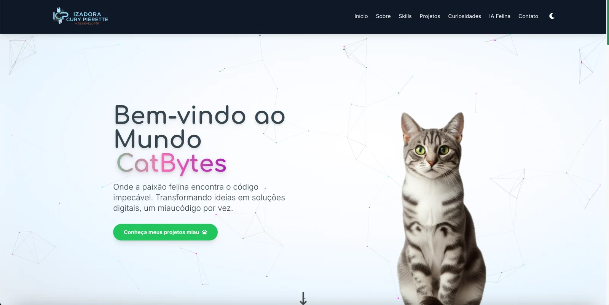
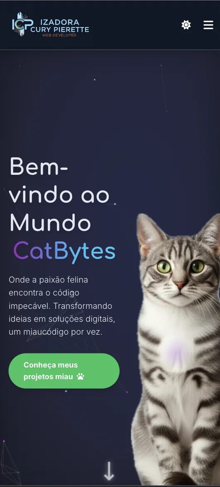

#  CatBytes — Portfólio Criativo de Front-end, Automação e IA

[English Version](./README.en.md)

<p align="center">
  <a href="https://app.netlify.com/sites/catbytes/deploys">
    
  </a>
  <a href="https://github.com/ipierette/CatBytes/commits/main">
    
  </a>
  <a href="./LICENSE">
    
  </a>
  <br />
  
  
  
  <a href="https://www.linkedin.com/in/izadora-cury-pierette-7a7754253">
    
  </a>
</p>

---

## 📖 Sobre o Projeto
O **CatBytes** é um portfólio criativo que combina **design moderno**, **código limpo** e **soluções com inteligência artificial e automação**.  
Este projeto foi desenvolvido para apresentar minhas habilidades como desenvolvedora web, com foco em **responsividade**, **acessibilidade** e **experiências interativas**.  

---

## ✨ Funcionalidades
- Layout responsivo (desktop, tablet e mobile).  
- **Dark mode** dinâmico.  
- Galeria de projetos com **lazy loading** otimizado.  
- Integrações com **Netlify Functions + IA**.  
- Componentes interativos com **JavaScript modular**.  
- **Score da IA** em anúncios, com explicação interativa.  
- **Uso da IA** para identificar gatinhos, com observações sobre a foto utilizada.
- Gerador de texto de anúncios **através da IA** com **geração de Estratégia de Postagem**.    
- Estrutura de CSS organizada em módulos: `reset.css`, `variables.css`, `responsive.css`, `animations.css` etc, pronta para evoluir com vite e react.  

---

## 🗂️ Estrutura do Projeto
A estrutura principal é:

```
css/          → Estilos globais e modulares
images/       → Ícones, favicons e assets do site
js/           → Scripts organizados em módulos
netlify/      → Funções serverless
scripts/      → Scripts auxiliares
test/         → Testes automatizados
index.html    → Entrada principal
README.md     → Documentação do projeto
```

---

## 🚀 Deploy
O projeto está publicado em **Netlify**.
🔗 **Demo online**: (https://catbytes.netlify.app/)

---

## 💻 Como Executar Localmente(Não é permitida cópia integral do projeto #Licença)

1.  **Clone o repositório:**
    ```bash
    git clone [https://github.com/seu-usuario/catbytes.git](https://github.com/ipierette/catbytes-portifolio)
    ```

2.  **Navegue até o diretório:**
    ```bash
    cd catbytes
    ```

3.  **Abra o `index.html` no seu navegador:**
    - Você pode simplesmente abrir o arquivo `index.html` diretamente ou usar uma extensão como o "Live Server" no VS Code para uma melhor experiência de desenvolvimento.

---

## 🛠️ Tecnologias Utilizadas
- **HTML5** semântico  
- **CSS3 avançado + TailwindCSS**  
- **JavaScript ES6+ modular**  
- **Netlify Functions** para IA e automação  
- **Git + GitHub** para versionamento  

---

## 📸 Preview

<details>
  <summary>Clique para ver o preview da versão Desktop e Mobile</summary>

  ### Versão Desktop
  

  ### Versão Mobile
  
</details>
---

## 📌 Roadmap Futuro
- [ ] Migrar frontend para **React.js + Vite**.  
- [ ] Melhorias de performance (Lighthouse > 95).  
- [ ] Dashboard com IA interativa.  
- [ ] Melhorar fallback e mensagens quando integrações externas não respondem (adopt-cat).
- [ ] Limpar comentários dos arquivos, foram úteis durante o Desenvolvimento mas futuramente serão todos removidos.
- [ ] Adicionar testes de acessibilidade (axe) e smoke tests de tabs.
- [ ] Criar preset de animações com prefers-reduced-motion.
---

## 📜 Licença
Este projeto é distribuído sob a licença personalizada disponível em [LICENSE](./LICENSE).  
Você pode modificar e adaptar o código para uso pessoal ou como referência, **mas é proibido copiar o projeto integralmente ou reproduzir sua identidade e personalidade**.  

---

## 👩‍💻 Autora

**Izadora Cury Pierette**  

- 🌐 [LinkedIn](https://www.linkedin.com/in/izadora-cury-pierette-7a7754253)  
- 🐈‍⬛ [GitHub](https://github.com/ipierette)  
- ✉️ [E-mail](mailto:ipierette2@gmail.com)  

---

> 💡 _“Entre linhas de código e miados curiosos, o futuro também ronrona em bytes.”_
